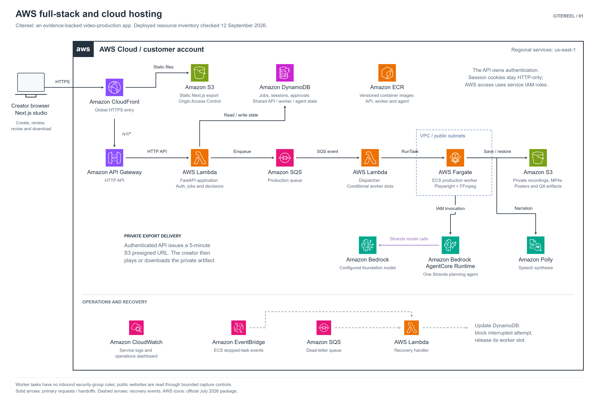

# Citereel

**Turn a product website into a narrated demo, with sources you can review.**

Citereel helps founders and product marketers turn product pages into presentations, walkthroughs, spotlights, and portrait shorts. A Strands Agents planner inspects the authorized website and prepares a source-linked storyboard. After any required human review, a background worker records the pages, generates optional narration and captions, renders an MP4, and checks the result. Creators can revise the story while retaining previous exports and reusable footage.

[Live demo](https://dqhy3yyc3g60j.cloudfront.net/) · [Open studio](https://dqhy3yyc3g60j.cloudfront.net/studio/) · [Cloud verification](https://dqhy3yyc3g60j.cloudfront.net/verification/) · [Judge walkthrough](docs/judge-guide.md)

Formerly **Launchpad Concierge**. Python packages, environment variables, AWS resources, and historical receipts retain `launchpad` names for compatibility.

## Why it exists

Making a product demo involves researching the product, writing a script, recording screens, narrating, editing, and repeating that work when the product changes. Citereel connects those steps in one production workflow. Source references and review checkpoints help creators catch unsupported claims before they become a video. Website text-change checks identify affected scenes so a revision can preserve useful recordings.

## Try it

1. Open the [studio](https://dqhy3yyc3g60j.cloudfront.net/studio/) and create an account. Hosted generation uses the deployment's AWS configuration; testers do not enter AWS keys.
2. Choose an included Northstar or Relay sample, or an authorized public product website. Start with a 30-second production and enable storyboard review.
3. Inspect the agent's sources, claims, and script. Correct or acknowledge claims requiring review, then approve the storyboard.
4. Play the completed video, inspect its receipts, and download the MP4. Try a revision to see the new plan and retained export versions.

Public samples and the verification page can be viewed without an account. Live generation takes time and depends on AWS availability and the source website. The default allowance is 20 accepted productions per user per UTC day. The [judge guide](docs/judge-guide.md) covers the full testing path and failure recovery.

## Architecture



The hosted frontend is a Next.js static export on S3, delivered through CloudFront. `/v1/*` requests reach a FastAPI Lambda through API Gateway. DynamoDB stores production state; SQS and a dispatcher launch Fargate workers. Workers invoke the Strands planner in Bedrock AgentCore, then use Playwright, Amazon Polly, and FFmpeg to produce private S3 exports. The API checks ownership before issuing temporary download URLs.

| View | Diagram | Editable source |
| --- | --- | --- |
| Full stack and AWS hosting | [PNG](docs/architecture/01-aws-full-stack.png) | [SVG](docs/architecture/01-aws-full-stack.svg) |
| Backend production and approval flow | [PNG](docs/architecture/02-backend-production-workflow.png) | [SVG](docs/architecture/02-backend-production-workflow.svg) |
| Strands agent loop | [PNG](docs/architecture/03-strands-agent-loop.png) | [SVG](docs/architecture/03-strands-agent-loop.svg) |
| Lifecycle hooks and policy checks | [PNG](docs/architecture/04-agent-policy-hooks.png) | [SVG](docs/architecture/04-agent-policy-hooks.svg) |

See [diagram sources and deployment scope](docs/architecture/README.md), [architecture details](docs/architecture.md), and [AWS release instructions](docs/agentcore-operations.md).

## How Strands does the work

The [planner](services/agent/src/launchpad_agent/concierge.py) uses the Strands Agents SDK with Amazon Bedrock. It reasons over tool results and can correct a rejected storyboard before submitting a valid plan.

| Tool | Responsibility |
| --- | --- |
| `get_production_brief` | Read the creator's intent, format, and constraints. |
| `inspect_authorized_site` | Inspect bounded source pages and return citable evidence. |
| `submit_storyboard` | Validate scene structure, source references, narration budget, and numerical claims. |
| `request_human_decision` | Pause when the creator must resolve a decision. |

[Policy hooks](services/agent/src/launchpad_agent/policies.py) check tool prerequisites, cancellation, and outcomes. Planning is bounded to eight turns, ten tool calls, 45,000 total tokens, and 10,000 output tokens. Source attribution supports review; it does not establish semantic truth.

The [worker](services/worker/src/launchpad_worker/runner.py) owns capture, narration, rendering, and media QA. Approval pauses persist state and release the worker. Cloud retries can restore hash-checked recording checkpoints, while attempt checks prevent a cancelled or stale planner from saving changes. Export approval records the creator's decision; delivery is by playback and download.

## Run locally

Prerequisites: **Node.js 22.22.2**, **Python 3.11+**, and **FFmpeg with ffprobe on PATH**. Windows PowerShell commands are shown below. On macOS/Linux, use `.venv/bin/python` instead of `.venv/Scripts/python.exe`. Linux may also need Chromium system libraries installed with `.venv/bin/python -m playwright install --with-deps chromium`.

```powershell
git clone https://github.com/vvdotcom/Citereel.git
cd Citereel
npm ci
npm run setup
# Create configuration only if you do not already have a private .env.
if (-not (Test-Path .env)) { Copy-Item .env.example .env }
```

`npm run setup` creates the Python virtual environment, installs backend dependencies, and downloads Playwright Chromium. Configure `.env` before generating a video:

```dotenv
AWS_REGION=us-east-1
BEDROCK_MODEL_ID=amazon.nova-lite-v1:0
LAUNCHPAD_VOICE=polly
```

Use an AWS profile, temporary credentials, or a workload role with access to the selected Bedrock model and `polly:SynthesizeSpeech`. A Bedrock API key can instead be set as `AWS_BEARER_TOKEN_BEDROCK` (`BEDROCK_API_KEY` is also supported), but Polly still needs signed AWS credentials. Choose a model and Polly voice/engine available to your account and region; see [.env.example](.env.example) for the remaining settings.

```powershell
npm run dev
```

Open **http://127.0.0.1:3011**. The launcher starts Next.js, the FastAPI service on port 8011, and the queue worker. Register an account or choose the local workspace option. Stop the services with Ctrl+C. For a production web build locally, use `npm run build` followed by `npm start`.

Local mode uses SQLite and `.launchpad-data/`; it does not require the cloud DynamoDB/SQS/AgentCore deployment. Bedrock and Polly calls incur AWS usage. Windows test narration is explicitly available with `LAUNCHPAD_VOICE=windows`. The deterministic fixture planner is also an explicit testing option. Neither silently replaces a failed AWS service.

The local studio also offers a **Cinematic** visual style with animated headings and a **Silent — add voice later** narration option. Silent exports omit audio and captions and do not invoke Polly. Live Bedrock planning still needs AWS access. See [video production notes](docs/video-production.md) for the short Citereel demo and the reusable recording-to-film command. These additions have been verified locally; the existing public samples describe their own older renderer.

Keep `.env` and AWS credentials private. Local sessions, generated builds, and verification scratch files are excluded from Git. Curated public assets are included under `public/`.

## Verify the installation

Install the additional test dependencies, then run:

```powershell
.venv/Scripts/python.exe -m pip install -r requirements-dev.txt
npm run lint
npm run typecheck
npm run build
.venv/Scripts/python.exe -m pytest -q
```

The automated suite covers source validation, Strands tool execution with a stubbed model transport, approvals, account isolation, queue behavior, and published media integrity. Stubbed tests do not establish live AWS availability.

Optional live checks use your AWS configuration and incur usage:

```powershell
.venv/Scripts/python.exe scripts/bedrock_check.py --invoke
.venv/Scripts/python.exe scripts/verify_pipeline.py --bedrock
```

Published evidence includes the [cloud report](public/verification/cloud-report.json), [cloud receipt](public/verification/cloud-receipt.json), and [sample measurements](public/examples/manifest.json). See [verification notes](docs/verification.md) for recorded runs and reproduction commands. Historical receipts describe those runs, not current service health.

## Scope and evidence

- Four formats support landscape and portrait output, with requested durations of 30, 45, 60, 90, 120, or 180 seconds and 3–12 scenes.
- Inspection is limited to three same-origin public pages. Login flows, arbitrary forms, and external publishing integrations are outside the implemented workflow.
- Website change checks compare bounded text. Scheduled monitoring exists in the infrastructure source but was absent from the deployed stack inventory checked on September 12, 2026.
- CloudWatch service logs and an operations dashboard are documented. Full AgentCore trace export remains incomplete.
- Caption timings are approximate. Sample duration means playback length; the samples are not a controlled speed, cost, or quality benchmark.
- The landing page shows three user-supplied feedback quotes from friends who tried CiteReel. They are qualitative feedback, not evidence of adoption, time savings, or commercial impact. Founder-test personas and the Northstar/Relay products are fictional fixtures; broader real-user validation remains to be done.

## Repository map

| Path | Contents |
| --- | --- |
| `src/` | Next.js landing page, studio, and production interface |
| `services/agent/` | Strands planner, tools, contracts, hooks, and AgentCore runtime |
| `services/api/` | FastAPI endpoints, authentication, production state, and storage |
| `services/worker/` | Capture, narration, rendering, revision, and recovery workflow |
| `infra/` | AWS templates, dispatcher, monitoring, and recovery functions |
| `public/` | Curated examples, verification evidence, and website assets |
| `tests/`, `scripts/` | Automated checks, setup, and release utilities |
| `docs/` | Architecture diagrams, judge guide, deployment, and verification notes |

## Credits and prior-work disclosure

The project uses Next.js, React, Tailwind CSS, Preline UI, Strands Agents, boto3, FastAPI, Playwright, Pillow, and FFmpeg. JavaScript dependencies are recorded in [package-lock.json](package-lock.json); Python dependencies are pinned in [requirements.txt](requirements.txt) and [requirements-dev.txt](requirements-dev.txt). AI coding assistance and AI image generation were used during development.

Design references include the earlier ProjectV/Veyframe workspace and `presentation-story@2` layouts, plus supplied circuit-style slide and testimonial references. The [design notes](docs/design-refresh.md) describe those influences and earlier layout reproductions; [editorial.py](services/worker/src/launchpad_worker/editorial.py) identifies the referenced geometry. A supplied Curtail demo informed the pacing and typography of the [silent first cut](docs/video-production.md); its media and branding are not included. These references are disclosed as prior design work. The [submission checklist](docs/hackathon-checklist.md) tracks the remaining provenance confirmation.

Inter and Roboto Mono include their [Inter](assets/Inter-LICENSE.txt) and [Roboto Mono](assets/RobotoMono-LICENSE.txt) notices. Preline's notices are in [Preline-LICENSE.txt](assets/Preline-LICENSE.txt). Diagrams use official AWS icons with [source attribution](docs/architecture/README.md#aws-icon-source). Third-party assets and trademarks retain their respective terms; the AWS documentation example does not imply an Amazon endorsement.

## License and hackathon materials

Citereel's project code is released under the [MIT License](LICENSE). The existing copyright notice retains the former Launchpad Concierge name.

This repository provides source, setup instructions, architecture diagrams, and testing documentation for the **Agents for Humans Hackathon**. The [submission checklist](docs/hackathon-checklist.md) tracks the separate public video, repository visibility, provenance, and judge-access requirements. A README alone does not complete the Devpost submission.

Recording materials: [4:25 demo script with AWS deployment walkthrough](docs/demo-script.md) and [project description draft](docs/project-description.md).
