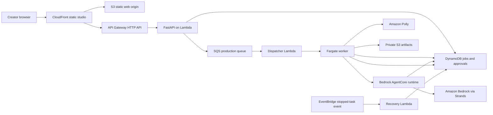
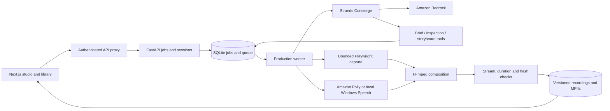

# Citereel architecture

The creator starts a production once. A persistent worker claims the job, invokes Strands, captures the inspected website, narrates and renders the approved plan, and saves the export with media checks.

## Deployed cloud architecture

The [AWS icon diagram and three workflow diagrams](architecture/README.md) are available as PNG and editable SVG files for the submission. The abbreviated overview below distinguishes the deployed cloud path from local development.

Scheduled source-monitoring code and an infrastructure definition exist, but that monitor was absent from the deployed inventory checked September 12, 2026. Manual source checks remain available. The deployed EventBridge recovery rule handles stopped workers; it is separate from source monitoring.

## Local development architecture

Job creation is idempotent per workspace. SQLite `BEGIN IMMEDIATE` protects creation, worker claims, approval state and version checks. Workers hold a renewable lease. An interrupted lease blocks the job for an explicit retry; it does not silently spend model quota. Copies of past exports remain available across revisions. Copy/caption changes reuse recordings; reordering scenes invalidates capture.

The model can call four scoped tools: read creator intent, inspect an authorized site, save a schema-validated storyboard, or request a human decision. The agent has bounded turns/tokens. It receives no environment credentials. Page content is untrusted evidence; it cannot add tools or run code. Only inspected page IDs and fixed scroll choices can enter a storyboard.

Public fetches check all DNS results and pin the connection to a verified public IP while preserving TLS hostname verification. Browser requests are intercepted, restricted to read-only requests on the authorized origin, and fulfilled through the same bounded fetcher. Unknown navigation targets, challenges, downloads and popups are blocked. Capture uses reviewed links and fixed, application-authored pointer overlays.

The web server proxies session cookies to FastAPI using an internal process secret. The browser never receives AWS credentials. Account passwords use salted PBKDF2; sessions are stored by token hash. Local workspace entry is intended for a single-user local server and is disabled in the container configuration.
